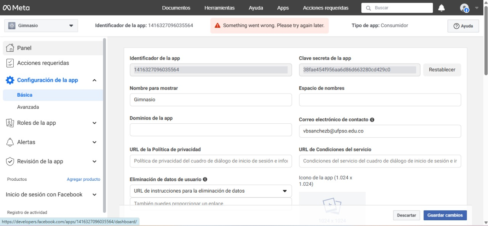

# Configuración en Facebook for Developers (Login con Facebook)

🌐 Aquí configuramos paso a paso la autenticación con Facebook desde Facebook for Developers.

---

## 1. Creamos nuestra aplicación en Facebook

🧰

- Entramos a [https://developers.facebook.com](https://developers.facebook.com) y nos autenticamos con nuestra cuenta personal.
- Hicimos clic en **"Mis apps"** y luego en **"Crear app"**.
- Elegimos el tipo de app **"Consumer"** y le pusimos un nombre, luego se creó la app. 
---

## 2. Agregamos el producto "Facebook Login"

🔗

- Una vez dentro del panel de la app, nos dirigimos al menú lateral y seleccionamos **"Agregar producto"**.
- Buscamos **"Facebook Login"** y le dimos clic en **"Configurar"**.
- Elegimos **"Web"** como plataforma.

---

## 3. Configuramos la URL de nuestro sitio web

🌍

- En el asistente de configuración, escribimos la URL de http://localhost:4200/facebook-callback. 

---

## 4. Copiamos nuestras credenciales

🔑

- Entramos a **"Configuración > Básica"** desde el menú lateral.
- Copiamos el **App ID**.
- Le dimos clic en **"Mostrar"** para ver el **App Secret** (tuvimos que ingresar nuestra contraseña de Facebook).

# 🔐 Paso 5: Agregar las credenciales en backend y frontend

---

## ⚙️ En el backend (UserController)

- Insertamos el **App ID** y **App Secret** obtenidos de Facebook en el controlador encargado de la autenticación.
- Estas credenciales se usan para validar el token de acceso que envía el frontend.
- Así, el backend puede verificar que el token es válido y autenticar al usuario correctamente.

---

## 🌐 En el frontend (facebook.ts)

- Configuramos el servicio para usar el SDK de Facebook y obtener el token de acceso (`accessToken`).
- Luego, enviamos ese token al backend para que realice la validación con las credenciales.
- Esto permite que la autenticación sea segura y centralizada en el servidor.

---

